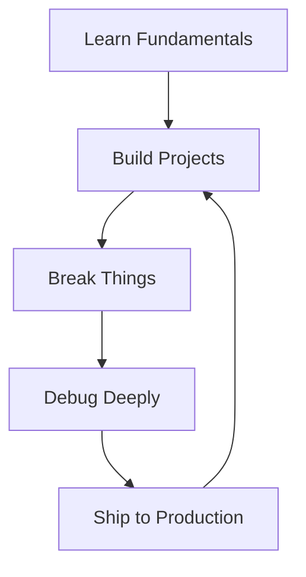
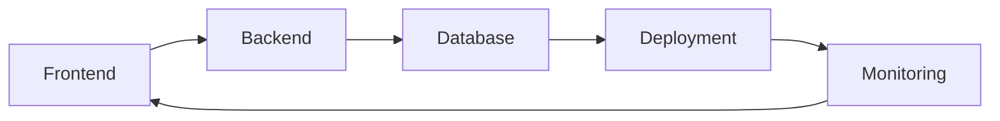
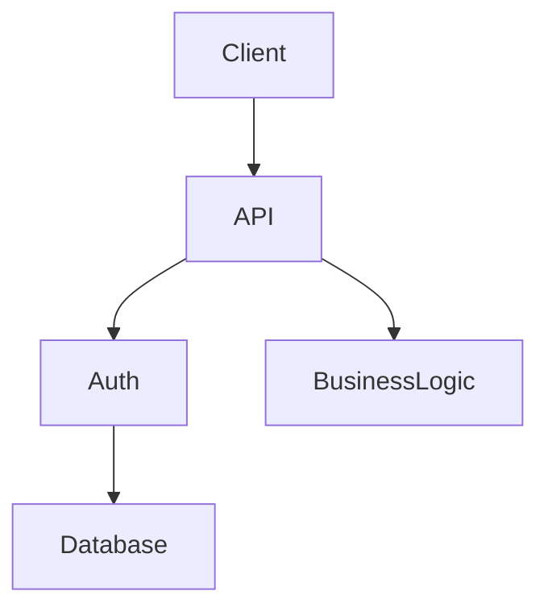
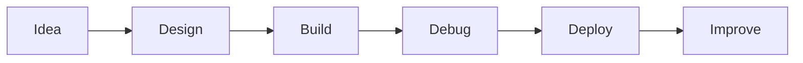

# 👋 Hi, I’m Colote Jayanth (Future Version)

  

> This README is written by the *future version of me* — the engineer I’m actively becoming.
> If you’re reading this, you’re not here to dabble. You’re here to **get really good**.

---

## 📊 GitHub Activity & Commitment

  
  

  

> **Rule:** If this graph is empty, I’m lying to myself.

---

## 🎯 Mission

Become a **high-impact Full Stack Engineer** who:

* Understands systems end-to-end (frontend → backend → database → deployment)
* Writes clean, scalable, readable code
* Ships production-ready features
* Is reliable, curious, and valuable in a fast-moving startup environment

This is not a wish list. This is a **daily operating system**.

---

## 🧠 Engineering Philosophy

* Fundamentals > frameworks
* Shipping > perfection
* Clarity > cleverness
* Ownership > excuses
* Debugging is a skill, not a weakness

---

## 🧩 Full Stack Skill Map

---

## 🌐 Frontend Stack

  

* HTML5 (semantic)
* CSS3 (Flexbox, Grid)
* JavaScript (ES6+)
* React

---

## 🔧 Backend Stack

* Node.js
* Express.js
* REST APIs
* Authentication (JWT)

---

## 🛠 Project Execution Flow

---

## 🧪 Daily Discipline

  

* Code every day
* Commit every day
* Push imperfect work
* Improve relentlessly

---

## 🔮 Final Reminder

> You are early.
> You are capable.
> Act like the engineer you want to become.

**This README is a promise — not a dream.**
